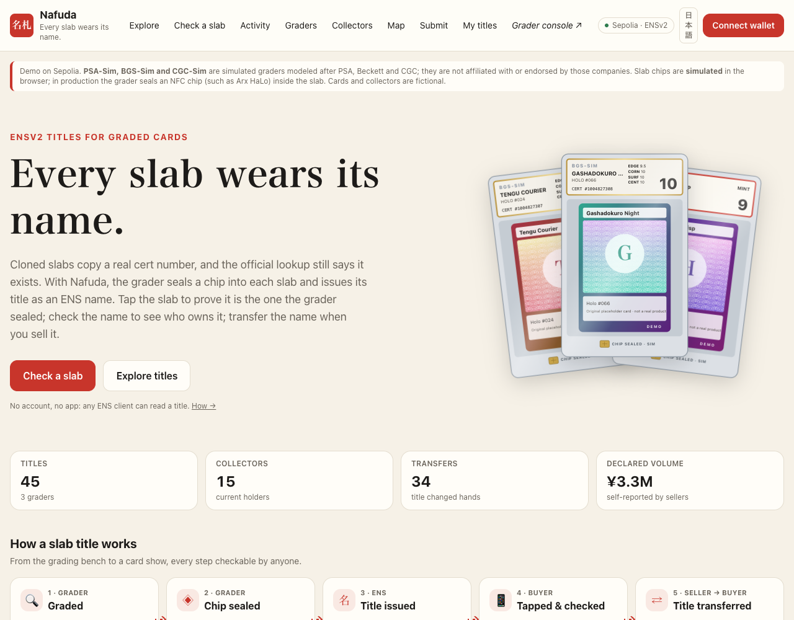
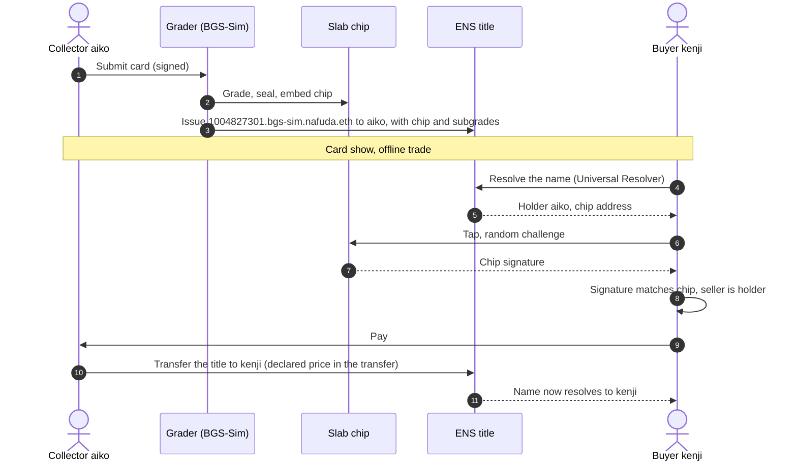
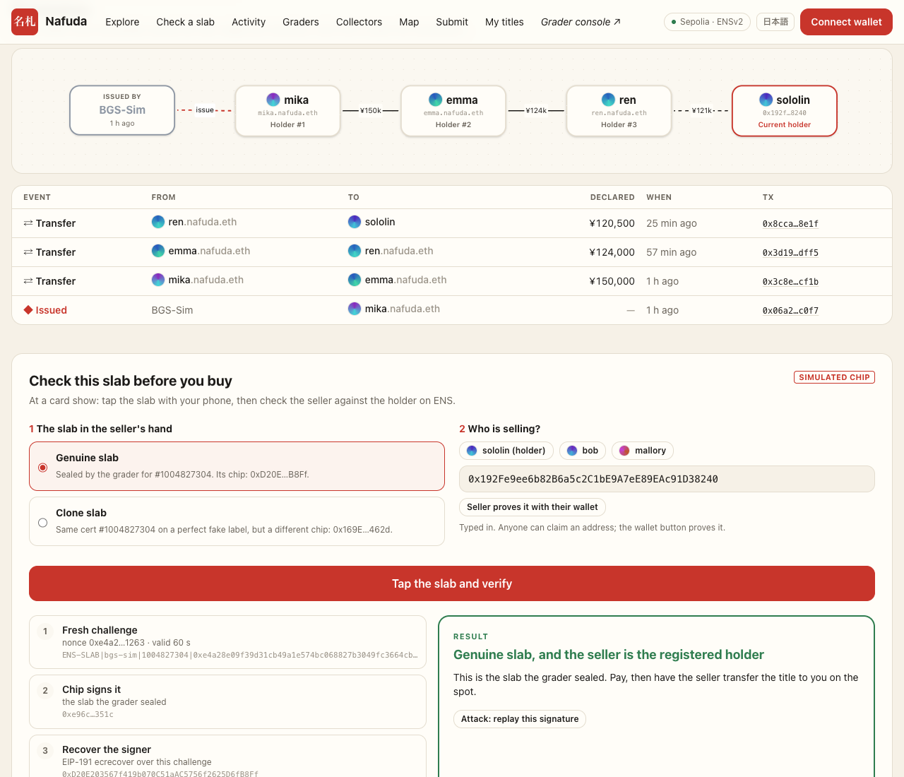
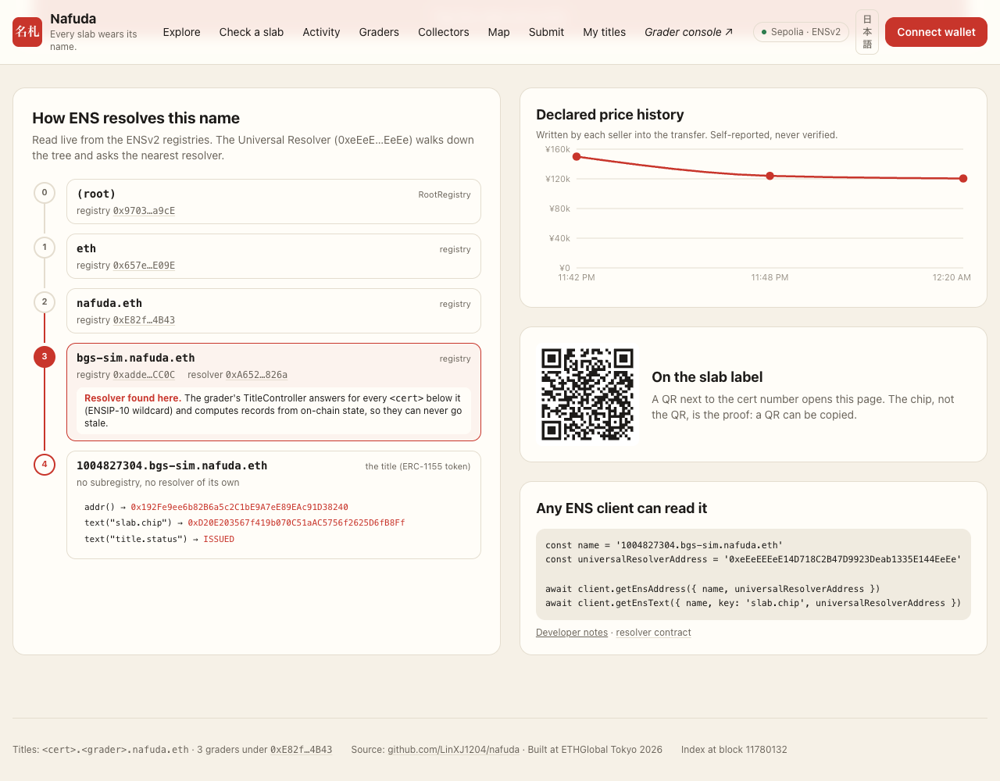
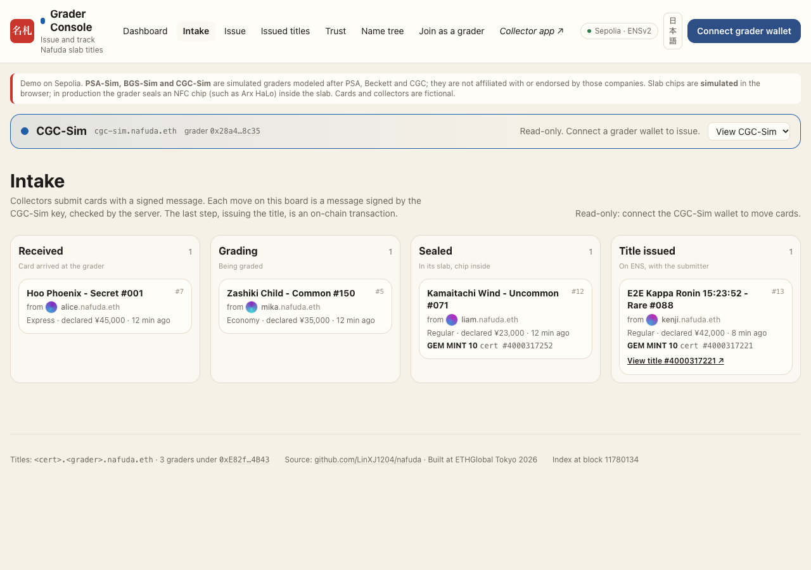
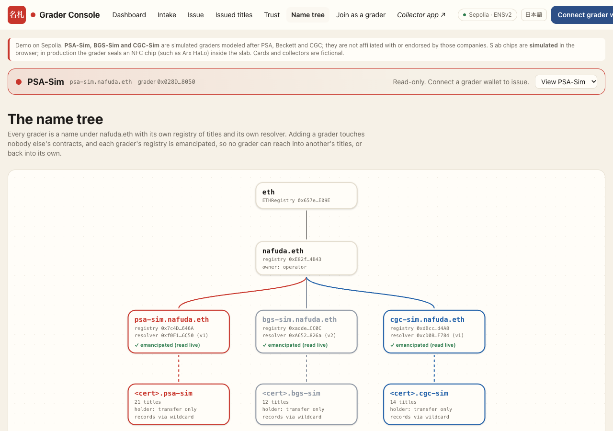
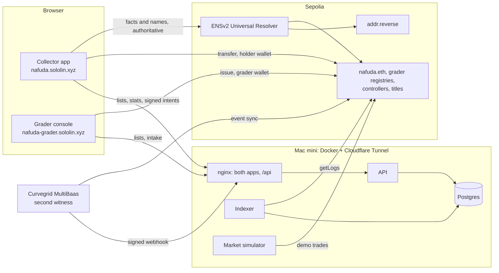

# Nafuda 名札

**Every slab wears its name.**

Nafuda gives every graded trading-card slab an **ENSv2 name that works as its title**. The grader seals a chip into the slab and issues the name `<cert>.<grader>.nafuda.eth`: it records the chip and resolves to the current owner. At a card show, a buyer taps the slab and checks two things on the spot: *is this the slab the grader sealed?* and *is the seller the registered owner?* Selling the slab is a transfer of the name.

> **One-sentence summary:** Graders issue each slab an ENSv2 title name bound to a chip sealed inside the slab, so anyone can verify a slab's authenticity and ownership with any ENS client, and selling it is an ENS name transfer.

[](https://github.com/LinXJ1204/nafuda/actions/workflows/contracts.yml)
[](https://github.com/LinXJ1204/nafuda/actions/workflows/web.yml)

- **Collector app:** https://nafuda.sololin.xyz (browse titles, check a slab, see provenance, trade interest, submit a card)
- **Grader console:** https://nafuda-grader.sololin.xyz (intake board, issue titles, trust panel, name tree)
- **Try a name:** `12345678.psa-sim.nafuda.eth` or `1004827301.bgs-sim.nafuda.eth` with any ENS client pointed at the ENSv2 Beta Universal Resolver
- **Contracts and transactions:** [docs/deployments.md](docs/deployments.md)

> **Disclaimers.** *PSA-Sim*, *BGS-Sim* and *CGC-Sim* are simulated graders modeled after the formats of PSA, Beckett (BGS) and CGC Cards. They are not affiliated with or endorsed by those companies. Slab chips are **simulated** in the browser. Card names, collectors and their trades are fictional demo data; the trades are real Sepolia transactions made by a simulator. Everything runs on the Sepolia testnet.



---

## The problem

- **Cloned certs pass the official lookup.** Counterfeiters copy a real cert number of the same card and grade onto a fake label and slab. A cert lookup only proves that the *number* exists, so the clone passes.
- **Cert numbers are sequential,** so real, never-shown numbers for a target card are easy to find.
- **The industry is moving to chips, but each in its own silo.** Coin slabs have carried NFC chips since 2020, and card graders are following. Each is one company's database, and none of them tracks who owns the slab.

## How it works

1. **Grading.** The grader seals an NFC chip inside the slab and issues the title name `<cert>.<grader>.nafuda.eth` to the submitter. The name records the chip's address, never expires, and its holder can only transfer it.
2. **Buying.** The buyer looks the cert up through ENS and taps the slab: the chip signs a fresh random challenge, and the signature must match `slab.chip`. Then the buyer checks that the name resolves to the seller.
3. **Selling.** The seller transfers the name (ERC-1155 `safeTransferFrom`). From then on it resolves to the buyer.



| Chip | Title holder | Result |
|---|---|---|
| ✓ | = seller | Genuine slab, seller is the registered holder |
| ✓ | ≠ seller | Genuine slab, but the seller is not the holder (possibly stolen, or a sale was never recorded) |
| ✗ | — | Not the slab the grader sealed (clone, or chip swapped) |
| no title | — | Cannot tell (grader not participating, or an older slab) |

**A cert number can be copied, a chip can't; a card can be stolen, a title can't.**

## What you can do on the live site

| Collector app | Grader console |
|---|---|
| **Title page:** the slab and its facts, resolved through ENS in your browser. It also shows a check that the server's index matches ENS, the provenance as a flow, the buyer check step by step, the live ENS resolution path, declared price history, a QR code for the label, and a transfer form for the holder | **Intake:** collectors' signed submissions, moved through received → grading → sealed → issued by grader-signed actions. The issued step is checked against the chain |
| **Explore, Activity, Market map:** every title, trade and holder across all graders | **Issue:** four steps, with every contract rule checked before signing. BGS-Sim adds four subgrades as ENS text records |
| **Trade interest:** holders sign an asking price, and collectors sign offers. These are signed intents only; the title still moves only by transfer | **Trust:** reads the registries live to show what the grader cannot do, and whether the final lock is applied |
| **Collectors:** each demo collector has a name like `aiko.nafuda.eth` and a primary name. The app shows names from ENS reverse resolution | **Name tree:** every grader under `nafuda.eth`, each with its own registry and resolver |
| English / 日本語 | The console detects the grader from the connected wallet and switches to that grader |

| | |
|---|---|
|  |  |
|  |  |

## Why ENS, and which ENSv2 features carry the weight

1. **Hierarchical registries: one namespace, many graders.** `nafuda.eth` → `<grader>` (each grader's own `UserRegistry`, deployed through the official `VerifiableFactory`) → `<cert>`. BGS-Sim and CGC-Sim joined after PSA-Sim without any change to PSA-Sim's contracts ([scripts/src/deploy-grader.ts](scripts/src/deploy-grader.ts)). Adding a grader still works after the final lock.
2. **Wildcard resolution off the parent's resolver (ENSIP-10).** Titles have no resolver of their own. The Universal Resolver walks the tree to `<grader>.nafuda.eth` and asks its resolver, the grader's controller ([TitleController](contracts/src/TitleController.sol), [TitleControllerV2](contracts/src/TitleControllerV2.sol)). [`resolve()`](contracts/src/TitleController.sol#L199) computes records from on-chain state, so they never go stale:
   - `addr`: the current holder
   - `text`: `slab.chip`, `title.status`, `card`, `grade`, `issued_at`, `grader`

   The title page draws this path live, level by level.
3. **Each grader brings its own record schema.** TitleControllerV2 stores grader-defined attributes and lists them in the `attributes` text record, so clients can discover them. BGS-Sim uses it for subgrades (`subgrade.centering` …), and any ENS client can read them.
4. **Enhanced Access Control as the trust model.**
   - A holder gets exactly `ROLE_CAN_TRANSFER_ADMIN`.
   - Each grader registry is **emancipated**. The controller holds `ROLE_REGISTRAR` and enforces its rules (one title per cert, chip recorded, transfer-only holder).
   - The grader keeps only `REGISTRAR_ADMIN`, `SET_PARENT` and `CAN_NAME`, so it cannot unregister, re-point or upgrade issued titles.
   - **Caveat:** in EAC an admin can grant its own role, so the grader could grant itself `ROLE_REGISTRAR` and register new certs outside the controller's rules. Titles already issued are unaffected. A title made that way fails the **per-title EAC checks** that the title page runs for every buyer: the resolver is found at the grader level and is the grader's controller, the controller has a record for the cert, and the holder is the sole assignee with only `CAN_TRANSFER_ADMIN`.

   The trust panel reads the registry-level roles live; [docs/access-control.md](docs/access-control.md) maps every resource and role.
5. **Safe transfers protect buyers.** `safeTransferFrom` only works on emancipated registries, and only when the holder is the sole assignee. So a buyer who receives a title knows nobody can claw it back. ENSv2 provides this; we did not have to write it.
6. **Names for people, too.** Demo collectors hold `<name>.nafuda.eth` (addr records in an official `PermissionedResolver`) and set it as their primary name. The apps show `aiko.nafuda.eth` by reverse-resolving through the ENSv2 Universal Resolver, not from a table.
7. **Any client can read it.** Titles are read with plain `viem.getEnsAddress` / `getEnsText` and the ENSv2 Universal Resolver ([packages/ui/src/ens.ts](packages/ui/src/ens.ts)). You don't need any Nafuda API.

A final, irreversible lock ([scripts/src/lock.ts](scripts/src/lock.ts)) also revokes the operator's and graders' power to swap a grader subtree or its resolver. It has been rehearsed on forks of the live deployment: the post-lock checks V9–V11 pass, transfers still work, and new graders can still be added. It has not been run on Sepolia yet.

## Architecture



- **ENS is the source of truth.** Title pages resolve through ENS in the browser and flag the server's index if it disagrees. The server holds an index (lists, stats, history), which can be rebuilt from the chain, and a store for signed off-chain intents, which cannot.
- **The two apps run on separate origins,** so the grader wallet and the collector wallet never share a connection in MetaMask.
- **A second, independent index.** Curvegrid MultiBaas indexes the same registries and pushes every event through a signed webhook. The server publicly compares the two indexes, both ways ([Curvegrid](#curvegrid)).
- **The server holds no keys** except the market simulator's demo keys, which are testnet only ([docs/hosting.md](docs/hosting.md)).

## Trust model: who can do what

| Actor | Can | Cannot |
|---|---|---|
| Grader | Issue a title for a cert once, with its chip; switch the issuing contract for **future** certs (which also means it could issue new certs outside the controller's rules; the per-title checks flag those); move its intake board | Change or revoke an issued title, change a chip record, unregister names, move another grader's submissions |
| Holder | Transfer the title; sign an asking price | Change the resolver or records; add delegates |
| Anyone | Read and verify through any ENS client; sign offers and submissions | Ask a price for a title they do not hold |
| Operator (us) | Before the final lock: replace a grader subtree. After it: add new graders and names only | After the lock: touch any existing grader subtree or title |
| Nafuda server | Index events; store signed intents | Move a title; change what ENS says |

**A chip signature is proof, never authorization.** Nothing changes state because a chip signed something.

## Honest limitations

- **Needs graders to participate.** Graders' incentive is that clones damage their brand, and chips are arriving in the industry, but adoption is an open question.
- **Covers only newly sealed slabs.** Existing slabs show "no title" until they are re-slabbed.
- **The chip is simulated.** In production it must be sealed *inside* the slab.
- **Card and title can be sold separately.** The check flags this ("seller is not the holder"), but only for buyers who check.
- **This is the price of emancipation.** Nobody can freeze a stolen title, and a lost wallet means a lost title. Planned recovery: the grader re-slabs the card with a new cert and chip and marks the old cert superseded. This is future work.
- **Declared prices are self-reported** by the seller in the transfer's data, and the site shows them as such.
- **NFC relay attacks** are a general limit of NFC verification and out of scope.
- **Titles are public.** A high-value card's holder address is visible, so holders should use a dedicated address.

## Planned upgrades

Written down, not built yet ([docs/plan/upgrades.md](docs/plan/upgrades.md)):

- **Card categories as ENS records.** Add `card.category` (`tcg`, `sports`, …), `card.game` or `card.sport`, `card.year`, `card.brand`, `card.number`, `card.subject` and `card.variety`, following the fields PSA shows on a cert page. Any `card.*` key is allowed. This needs a TitleControllerV3 that falls back to the old controller for titles already issued, so no issued title changes.
- **A client for card shops.** A counter mode (look up, tap, check the seller, take the title in), inventory with bulk asks, and a public storefront under `<shop>.nafuda.eth`.

## Repository

```
contracts/   Foundry. TitleController (v1) and TitleControllerV2 (attributes), 32 tests on the official ENSv2 fixture
packages/    core: shared pure logic (verification, rules, signed messages, deployment data), 26 tests
             ui: shared React components, ENS reads, wallet, API hooks
apps/        collector (nafuda.sololin.xyz) and grader (nafuda-grader.sololin.xyz): React + Vite + Tailwind
server/      TypeScript API (Hono) and indexer (getLogs → Postgres), 6 tests
scripts/     deploy, deploy-grader, seed, market simulator, collector names, lock, verify, report
e2e/         Chrome end-to-end suites: public (read-only, 26 checks) and live (writes on Sepolia)
hosting/     Docker images and compose (apps, api, indexer, db, market) behind a Cloudflare Tunnel
demo/        Graders, card catalog, collectors, simulated chip keys (public test keys)
docs/        Planning artifacts, AI usage log, deployments, hosting, demo script, review guide
```

## Run it

```bash
git clone --recursive https://github.com/LinXJ1204/nafuda && cd nafuda

# contracts
cd contracts && forge test && cd ..

# TypeScript: core and server tests, then an app against the live API
npm ci
npm test --workspace @nafuda/core --workspace @nafuda/server
API_URL=https://nafuda.sololin.xyz npm run dev --workspace @nafuda/collector   # http://localhost:5173

# everything in Docker (apps, api, indexer, Postgres): http://localhost:8088 and :8089
cd hosting && docker compose up -d --build

# end-to-end, read-only, against the live site
cd e2e && npm ci && npm run public
```

To deploy your own copy, see [scripts/](scripts/) (`deploy`, `deploy-grader`, `seed`, `names`) and [docs/hosting.md](docs/hosting.md).

## Team

- **LinXJ1204**, solo builder. <!-- TODO(author): one or two lines about yourself -->

## AI usage and planning artifacts

The idea, the product decisions and the trade-offs are the author's. The code was written by **Claude Code**, a coding agent, under the author's direction and review. [docs/ai-usage.md](docs/ai-usage.md) records, session by session, what the AI did and what the author decided. The planning documents, including the pre-kickoff brainstorm, are in [docs/plan/](docs/plan/README.md).

## Curvegrid

**RWA tokenization.** A graded card is a real-world asset held in a sealed slab, and Nafuda is its on-chain title:
- **Custody and provenance:** the grader seals a chip into the slab and records it in the title; every transfer is on chain.
- **Settlement:** selling the card is a transfer of the name, with the seller's declared price written into the transfer.
- **Programmable asset controls:** ENSv2 roles make the holder able to transfer and nothing else, and leave the grader no way to claw a title back. The registry enforces both ([docs/access-control.md](docs/access-control.md)).

**Dashboard.** The collector app has a market map (who holds what, who traded with whom, declared volume), activity and volume charts, and per-grader stats. The grader console has an intake board of cards waiting for each next step.

### How MultiBaas is used: a second witness

Nafuda's own server indexes chain events for lists and charts. **Curvegrid MultiBaas runs a second, independent index of the same contracts, and Nafuda publicly checks that the two agree.**

- **Linked contracts.** The three grader registries are linked in a MultiBaas deployment on Ethereum Sepolia, with a minimal ABI (`TransferSingle`, `TransferBatch`) and event sync on.
- **Webhook.** An `event.emitted` webhook pushes every event to `POST /api/hooks/multibaas`. The server:
  - checks the HMAC-SHA256 signature over body and timestamp, in constant time, and refuses deliveries more than 5 minutes old;
  - decodes the raw log itself;
  - stores it apart from the index. Redeliveries change nothing, and logs later reported as reorged are marked. Witness data is never copied into the index.
- **Two-way comparison.** `GET /api/witness` checks:
  - every event Curvegrid saw is in Nafuda's index, with the same transaction, log position, title, sender and recipient;
  - every transfer Nafuda indexed inside Curvegrid's window was seen by Curvegrid. This direction catches a server that invents a record.
- **On screen:**
  - the panel on the [Developers page](https://nafuda.sololin.xyz/developers#witness)
  - a status line on the Activity page, and a "✓ Curvegrid" mark on each witnessed event
  - a line on the grader console's Trust page

  The public e2e suite fails if the two indexes disagree.
- **Setup.** [scripts/src/multibaas.ts](scripts/src/multibaas.ts) uses the MultiBaas TypeScript SDK. Its commands are `plan`, `webhook`, `link` and `status`, and each can be re-run safely. The Administrator API key stays on the author's machine; the server only holds the webhook secret.
- **Why not more.** On the free plan, event indexing starts at most 100 blocks before a contract is linked, so MultiBaas cannot hold the history of titles issued earlier. Nor should one index be the only one. Its value here is that it is independent.

**Found along the way.** While choosing the events to link, we saw that ENSv2 registries emit `TransferBatch` when one call moves two or more names. Nafuda's indexer only read `TransferSingle`, so such a sale would have been missing from every list. The indexer now reads both. No batch transfer had happened yet, so no data was lost.

**In production:**
- a grader's issuing key belongs in an HSM (MultiBaas Cloud Wallets);
- its `REGISTRAR_ADMIN` role belongs behind a Safe (MultiBaas Safe Accounts).

### Feedback on MultiBaas

<!-- TODO(author): keep only what you ran into yourself while setting it up -->
- **What worked:**
  - From a new deployment to the first verified event took about 15 minutes. The webhook reached our server through Cloudflare on the first try, and the first three events all matched the index.
  - The full OpenAPI spec is public (`/api/v0/openapi.yaml`), so the API can be explored before signing up.
  - `startingBlock` accepts relative values such as `-100`.
  - `GET /plan` reports the real limits of the deployment.
- **What was hard:**
  - `POST /contracts/{label}` refuses a contract without `bin` (a database not-null error), although the OpenAPI spec and the SDK type mark it optional. Linking an already-deployed contract needs no bytecode; we pass an empty string.
  - The free plan's 100-block lookback is stated only in the pricing FAQ, not on the Event Indexing page. A team that deploys first and adds MultiBaas later cannot backfill.
  - The webhook page shows how the sender signs, but has no receiver-side example. It does not mention constant-time comparison or a replay window.
  - The Supported Networks table and the API reference render only in a browser, so scripts and LLM tools cannot read them.
