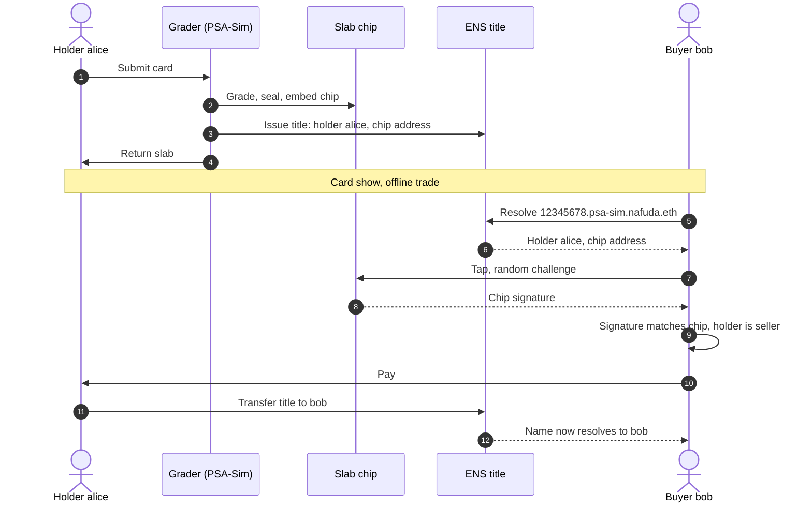
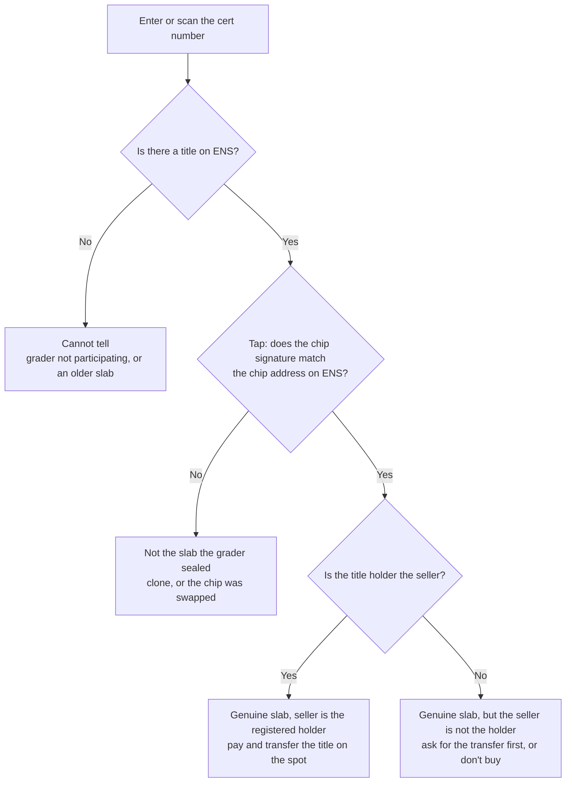

# Nafuda 名札

**Every slab wears its name.**

Nafuda gives every graded trading-card slab an **ENSv2 name that works as its title**. The name records the slab's chip key and resolves to the current owner. At a card show, a buyer taps the slab and checks two things on the spot: *is this the slab the grader sealed?* and *is the seller the registered owner?* A sale is a transfer of the name.

> **One-sentence summary:** Graders issue each slab an ENSv2 title name bound to a chip sealed inside the slab, so anyone can verify a slab's authenticity and ownership with any ENS client, and selling it is an ENS name transfer.

[](https://github.com/LinXJ1204/nafuda/actions/workflows/contracts.yml)
[](https://github.com/LinXJ1204/nafuda/actions/workflows/web.yml)

- **Live demo:** https://nafuda.sololin.xyz (Sepolia): the collector app at [`/`](https://nafuda.sololin.xyz/), the PSA-Sim grader console at [`/grader/`](https://nafuda.sololin.xyz/grader/)
- **Try a name:** `12345678.psa-sim.nafuda.eth` with any ENS client pointed at the ENSv2 Beta Universal Resolver
- **Contracts and transactions:** [docs/deployments.md](docs/deployments.md)

> **Disclaimers.** *PSA-Sim* is a simulated grader modeled after PSA's certification format and flow. It is not affiliated with or endorsed by PSA (Professional Sports Authenticator). The slab chips in the demo are **simulated** in the browser. The card names are original placeholders. Everything runs on the Sepolia testnet.

---

## The problem

- **Cloned certs pass the official lookup.** Counterfeiters copy a real cert number of the same card and grade, print it on a fake label, and put it in a fake slab. PSA's cert lookup only proves that the *number* exists, so the clone passes.
- **Cert numbers are sequential,** so real, never-shown numbers for a target card are easy to find. "Avoid numbers that were posted online" does not help.
- **The industry is moving to chips, but each in its own silo.** PCGS (coins) has sealed NFC chips in every slab since 2020, and a trading-card chip-verification service launched in 2026. Each one is a single company's database, and none of them tracks who owns the slab.

## How it works

1. **Grading.** The grader seals an NFC chip inside the slab and issues the title name `<cert>.psa-sim.nafuda.eth` to the submitter. The name stores the chip's address. It never expires, and the holder can only transfer it.
2. **Buying.** The buyer looks up the cert through ENS. The buyer's app sends the slab a fresh random challenge, the chip signs it, and the app checks the signature against `slab.chip`. Then it checks whether the name's address is the seller.
3. **Selling.** The seller transfers the name to the buyer with ERC-1155 `safeTransferFrom`. From then on, the name resolves to the new owner.



### What the buyer sees



| Chip | Title holder | Result |
|---|---|---|
| ✓ | = seller | Genuine slab, seller is the registered holder |
| ✓ | ≠ seller | Genuine slab, but the seller is not the holder (possibly stolen, or a sale was never recorded) |
| ✗ | — | Not the slab the grader sealed (clone, or chip swapped) |
| no title | — | Cannot tell (grader not participating, or an older slab) |

The one-liner: **a cert number can be copied, a chip can't; a card can be stolen, a title can't.**

### The web app

Two pages, one static build, no backend. Titles are resolved through ENS; lists and history come from on-chain events (`getLogs`), with no indexer or database.

| Collector app (`/`) | Grader console (`/grader/`) |
|---|---|
| **Explore**: every issued title, like a marketplace gallery | **Issue**: pick a sealed slab, name the submitter, issue the title. The console checks everything the contract would reject before asking the wallet to sign |
| **Title page**: the slab, its title resolved via ENS, the buyer check (tap the slab, compare seller and holder), the transfer history, and a transfer form that only the holder sees | **Issued titles**: current holder and number of transfers for each title |
| **My titles**: what a wallet holds now and held before | **Trust**: reads the registries live to show what PSA-Sim cannot do (emancipated, only the controller issues, holders can only transfer) and whether the final lock is applied |

## Why ENS, and which ENSv2 features carry the weight

1. **Wildcard resolution off the parent's resolver.** Title names have no resolver of their own. The Universal Resolver walks the registry tree down to `psa-sim.nafuda.eth` and asks its resolver, [`TitleController`](contracts/src/TitleController.sol), an ENSIP-10 extended resolver. [`resolve()`](contracts/src/TitleController.sol#L199) computes the records from on-chain state, so they can never go stale:
   - `addr`: the current holder (read from the registry)
   - `text`: `slab.chip`, `title.status`, `card`, `grade`, `issued_at`, `grader`

   Certs that were never issued resolve to `title.status = NONE`.
2. **Hierarchical registries.** `nafuda.eth` → `psa-sim` (the grader's own `UserRegistry`, deployed through the official `VerifiableFactory`) → `<cert>`. Each grader operates its own registry under a shared namespace, so this is not one company's database.
3. **Enhanced Access Control as the trust model.**
   - A title holder gets exactly [`ROLE_CAN_TRANSFER_ADMIN`](contracts/src/TitleController.sol#L51) and nothing else. Holders can't re-point the name's resolver and fake the chip record.
   - The grader's registry is **emancipated** (`isEmancipated() == true`). The only issuer is the controller (`ROLE_REGISTRAR`). The grader keeps only `REGISTRAR_ADMIN`, `SET_PARENT`, and `CAN_NAME`, so it cannot unregister, re-point, or upgrade issued titles.
4. **Safe-transfer buyer protection is built into v2.** `safeTransferFrom` only works on emancipated registries, and only if the holder is the token's sole assignee. A buyer who receives a title knows nobody can claw it back and no hidden delegate remains. We did not have to write any of this.
5. **Any client can read it.** The demo page uses plain `viem.getEnsAddress` / `getEnsText` with the ENSv2 Universal Resolver ([web/src/lib/ens.ts](web/src/lib/ens.ts)). There is no Nafuda API.

A final, irreversible lock ([scripts/src/lock.ts](scripts/src/lock.ts)) also revokes the operator's and grader's power to swap the `psa-sim` subtree or its resolver. After that, the chip records are immutable end to end. It has been rehearsed on a fork of the live Sepolia deployment: the post-lock checks V9–V11 pass, and transfers still work.

## Trust model: who can do what

| Actor | Can | Cannot |
|---|---|---|
| Grader | Issue a title for a cert once, with its chip address; swap the issuing contract for **future** certs | Change or revoke an issued title, change a chip record, unregister names |
| Holder | Transfer the title | Change the resolver or records; add delegates |
| Operator (us) | Before the final lock: replace the whole `psa-sim` subtree. After it: add new graders only | After the lock: touch any existing grader subtree or title |
| Anyone | Read and verify through any ENS client | — |

The design principle: **a chip signature is proof, never authorization.** Nothing changes state because a chip signed something. The chip will sign for anyone who taps it, and the design encourages letting buyers tap.

## Honest limitations

- **Needs graders to participate.** The demo uses PSA-Sim. Graders' incentive is that clones damage their brand, and chips are already arriving in the industry, but adoption is an open question.
- **Covers only newly sealed slabs.** Existing slabs have no chip and show "no title" until they are re-slabbed.
- **The chip is simulated.** In production it must be sealed *inside* the slab at encapsulation. An outside sticker can be peeled off and moved to a clone.
- **Card and title can be sold separately.** The chip + title check flags this ("seller is not the holder"), but only for buyers who check.
- **This is the price of emancipation.** Nobody can freeze a stolen title, and a lost wallet means a lost title. Planned recovery: the holder sends the slab back to the grader, which re-slabs it with a new cert and chip, and the old cert is marked superseded. This is future work.
- **NFC relay attacks** (forwarding the challenge to a distant genuine slab) are a general limit of NFC verification and are out of scope.
- **Titles are public.** A high-value card's holder address is visible, so holders should use a dedicated address.

## Repository

```
contracts/   Foundry. TitleController + 25 tests on the official ENSv2 fixture (contracts-v2 submodule @ 71a3b733)
scripts/     Node 24 + viem 2.56.8. preflight, deploy, issue, verify, transfer, lock, report
web/         Vite + TypeScript. Collector app (/) and grader console (/grader/); node tests for the pure logic
hosting/     Docker image (nginx, strict CSP) and compose file with a Cloudflare Tunnel; see docs/hosting.md
demo/        Simulated chip keys (public test keys) and signature test vectors shared by all of the above
deployments/ Sepolia deployment state; docs/deployments.md is generated from it
docs/        Planning artifacts (docs/plan), AI usage log, deployment report, hosting
```

## Run it

```bash
git clone --recursive https://github.com/LinXJ1204/nafuda && cd nafuda

# contracts: T1–T8 (issue, title rules, emancipation, resolve, chip verification, Universal Resolver end-to-end)
cd contracts && forge test -vv && cd ..

# web: scenario tests S1–S5 and the rest of the pure logic, then the app
cd web && npm ci && npm test && npm run dev   # http://localhost:5173/ and /grader/

# or the production image
cd hosting && docker compose up -d --build     # http://localhost:8088/
```

To deploy your own copy (Sepolia or an anvil fork), copy `.env.example` to `.env`, fund the operator, then run:

```bash
cd scripts && npm ci
npm run preflight -- --network sepolia
npm run fund      -- --network sepolia   # tops up the other demo accounts from the operator
npm run deploy    -- --network sepolia   # idempotent; commit-reveal computed locally
npm run issue     -- --network sepolia
npm run verify    -- --network sepolia   # V1–V7 (fork runs V8 transfer too)
npm run lock      -- --network sepolia   # dry run; add --execute --i-understand-this-is-irreversible
```

## Team

- **LinXJ1204**, solo builder. <!-- TODO(author): one or two lines about yourself -->

## AI usage and planning artifacts

This project was built with **Claude Code** as a development assistant. [docs/ai-usage.md](docs/ai-usage.md) records, work session by work session, what the AI did and what the author decided. The planning documents, including the pre-kickoff brainstorm and plans with honest timestamps, are in [docs/plan/](docs/plan/README.md).

## Curvegrid

Nafuda turns a physical collectible into a programmable, transferable on-chain title with built-in access control. MultiBaas was not used.
