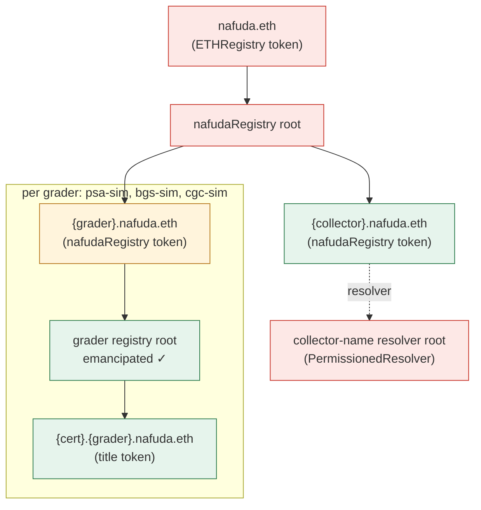

# Access control: how Nafuda uses ENSv2 Enhanced Access Control

Nafuda's trust model is ENSv2 **Enhanced Access Control (EAC)**. This document covers:
- every resource and every role in the deployment
- what each party can and cannot do
- what the final lock changes
- the per-title checks any buyer can run

Everything here can be read live:
- `cd scripts && npm run roles -- --network sepolia` prints the current map.
- The grader console's **Trust** page draws the same map from live reads, with a toggle that projects what the final lock changes.
- Every title page has **"Who can do what"**: each cell simulates that actor's call against the contracts (`eth_call`, nothing changes) and shows the contract's own answer. Next to it are attack buttons and the role bitmaps.
- Every title page also runs the per-title checks.

## EAC in six rules (from the pinned ENSv2 Beta source)

1. **Resources.** Each registry has one **root** resource and one resource per name (token). Roles are bitmaps, one per (resource, account).
2. **Root roles apply everywhere.** An account's effective roles on a name are its root roles plus its roles on that name.
3. **Admins grant.** On the root, holding a role's admin lets you grant that role *and* its admin. **On a name, a root admin can grant only the base role, never an admin role** (`_getSettableRoles` shifts the bitmap right by 128 for non-root resources).
4. **`CAN_TRANSFER_ADMIN` belongs to the token.** Transferring a name requires the sender to hold `ROLE_CAN_TRANSFER_ADMIN` on it. It is not grantable, and it is ignored on the root.
5. **Assignees are counted.** Each role has an assignee count, and two properties are built on these counts:
   - `isEmancipated()`: nobody holds `SET_SUBREGISTRY`, `SET_RESOLVER`, `UNREGISTER` or `UPGRADE` (or their admins) on the root.
   - `isOnlyAssignee()`: the account is the only holder of any role on a name.
6. **Safe transfers are protected.** A `safeTransferFrom` needs an emancipated registry, and needs the sender to be the only assignee of any role on that name. The sender's roles then move to the recipient.

## The map

Red means the operator holds power over it until the final lock. Amber means the grader holds power over it until the final lock. Green means it is fixed.

| Resource | Account | Roles | Why | After the final lock |
|---|---|---|---|---|
| `nafuda.eth` (ETHRegistry) | operator | `SET_SUBREGISTRY`(+admin), `SET_RESOLVER`(+admin), `CAN_TRANSFER_ADMIN` | Registered through the official ETHRegistrar | `SET_SUBREGISTRY`(+admin) revoked: the tree under `nafuda.eth` can no longer be swapped |
| nafudaRegistry root | operator | All roles | Creates the tree, adds graders and collector names | The emancipation roles are revoked, so the registry becomes emancipated. The operator keeps `REGISTRAR`, so it can still **add** graders and names, but not change existing ones |
| `<grader>.nafuda.eth` | grader | `SET_SUBREGISTRY`(+admin), `SET_RESOLVER`(+admin) | Lets the grader upgrade its registry or resolver before launch | Revoked, for **every** grader: `lock.ts` loops over all of them |
| grader registry root | grader | `REGISTRAR_ADMIN`, `SET_PARENT`(+admin), `CAN_NAME`(+admin) | Switch the issuing contract for future certs; name the registry | Unchanged (already emancipated) |
| grader registry root | controller | `REGISTRAR` | The only issuer in normal operation | Unchanged |
| title `<cert>` | holder | `CAN_TRANSFER_ADMIN` only | The holder can sell it, and nothing else | Unchanged |
| title `<cert>` | grader | none | The grader has no power over issued titles | Unchanged |
| `<collector>.nafuda.eth` | collector | `CAN_TRANSFER_ADMIN`, `SET_RESOLVER` | An **identity** name is its owner's to point anywhere; compare the titles, which are **assets** and transfer-only | Unchanged |
| collector-name resolver root | operator | All roles | Hosts the collectors' default addr records | Unchanged: owners can move to their own resolver with `SET_RESOLVER` |

## What each party can and cannot do

| Party | Can | Cannot |
|---|---|---|
| Holder | Transfer the title; sign asks | Change the title's resolver, subregistry or records; add a co-owner. It can grant only the base `CAN_TRANSFER`, which does nothing by itself, and while any other assignee exists, the title cannot be safe-transferred |
| Grader | Issue new titles through its controller. Switch the issuing contract for future certs with `REGISTRAR_ADMIN` | Unregister, re-point or change any issued title, since its registry is emancipated. Re-point its own subtree after the lock |
| Operator | Before the lock: replace a grader's subtree. After it: add new graders and names | After the lock: touch any existing grader or title |
| Anyone | Read and verify all of this | — |

## The caveat, and the per-title checks that cover it

Rule 3 means the grader's `REGISTRAR_ADMIN` also lets it grant **itself** `ROLE_REGISTRAR`. It could then register a new cert directly, outside the controller's rules. For example, it could give that cert its own resolver, or give its holder extra roles, so that its records could be changed later. Titles already issued are not affected. Removing `REGISTRAR_ADMIN` would close this, but it would also remove the grader's ability to upgrade its issuing contract.

Nafuda keeps the upgrade path and makes non-conforming titles **detectable per title**. The title page runs these checks for every buyer ([packages/core/src/integrity.ts](../packages/core/src/integrity.ts), read live by [packages/ui/src/integrity.ts](../packages/ui/src/integrity.ts)):

| Check | Reads | Catches |
|---|---|---|
| Answered by the grader's controller | `UniversalResolver.findResolver(name)`: the resolver must be found at the grader's name and must be its controller | A cert given its own resolver |
| Issued through the controller | `controller.holderOf(cert)` must be non-zero and equal to the ENS holder | A cert registered outside the controller |
| The holder can only transfer | `registry.roles(cert, holder) == ROLE_CAN_TRANSFER_ADMIN` | A holder given extra roles |
| Nobody else holds a role on this title | `registry.getAssigneeCount(cert, ALL_ROLES)`: exactly one assignee, of `CAN_TRANSFER_ADMIN` | Hidden co-assignees (which would also block safe transfers) |
| The grader's registry is emancipated | `registry.isEmancipated()` | A registry where someone could still unregister, re-point or upgrade names |

The same checks run as the last step of the buyer check ("Tap the slab and verify"). If any fails, the result carries a warning.

## How this is verified

- **Contract tests** ([contracts/test](../contracts/test)):
  - `test_setup_graderKeepsOnlyNonDangerousRootRoles`
  - `test_T1_issue_holderOwnsTitleWithOnlyTransferRole`
  - `test_T4_titleRegistryIsEmancipated`
  - `test_T4_graderCannotClawBackOrRepoint`
  - `test_T5_holderCannotSetResolverOrSubregistry`
  - the V2 equivalents
- **Pure rules with tests:**
  - [trust-rules.ts](../packages/core/src/trust-rules.ts): registry level, before and after the lock
  - [integrity.ts](../packages/core/src/integrity.ts): per title, including the bypass case above
- **Live:**
  - the Trust page
  - the title page's integrity card
  - `npm run roles`
  - `npm run verify` (V3, V4; V9–V11 after the lock)
  - the public e2e suite asserts all integrity checks pass on a live title
- **Rehearsals on forks:** the lock (V9–V11 pass, transfers still work), and adding graders after the lock.

## Known limits

- **The final lock has not run on Sepolia yet.** Until it does, the first three rows of the map are live powers. The Trust page says so.
- **`nafuda.eth` is registered for 10 years** and must be renewed like any .eth name. Anyone can renew it.
- **New graders added after the lock** start with `SET_SUBREGISTRY` / `SET_RESOLVER` on their own name, as the first three did. Each new grader should revoke them (`lock.ts` is re-runnable), or be registered without them.
