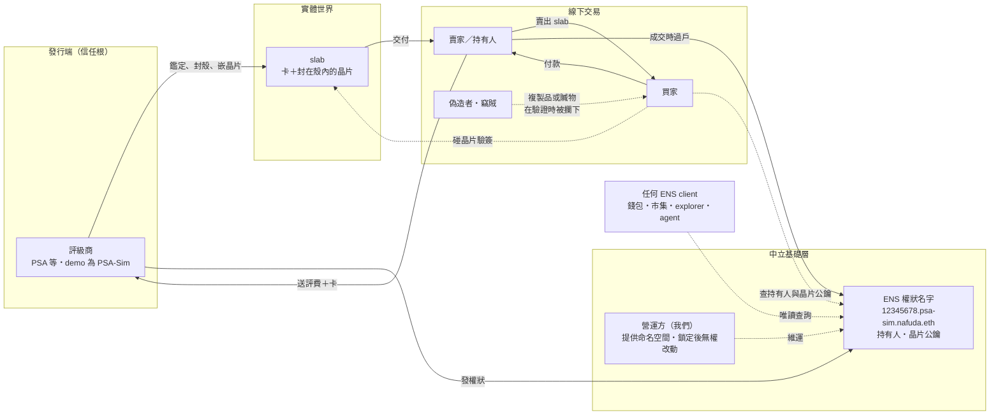
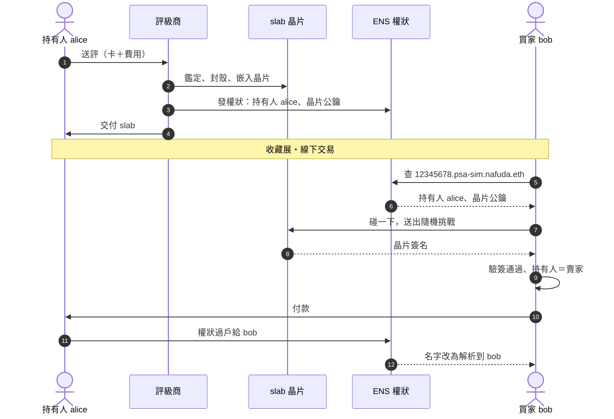
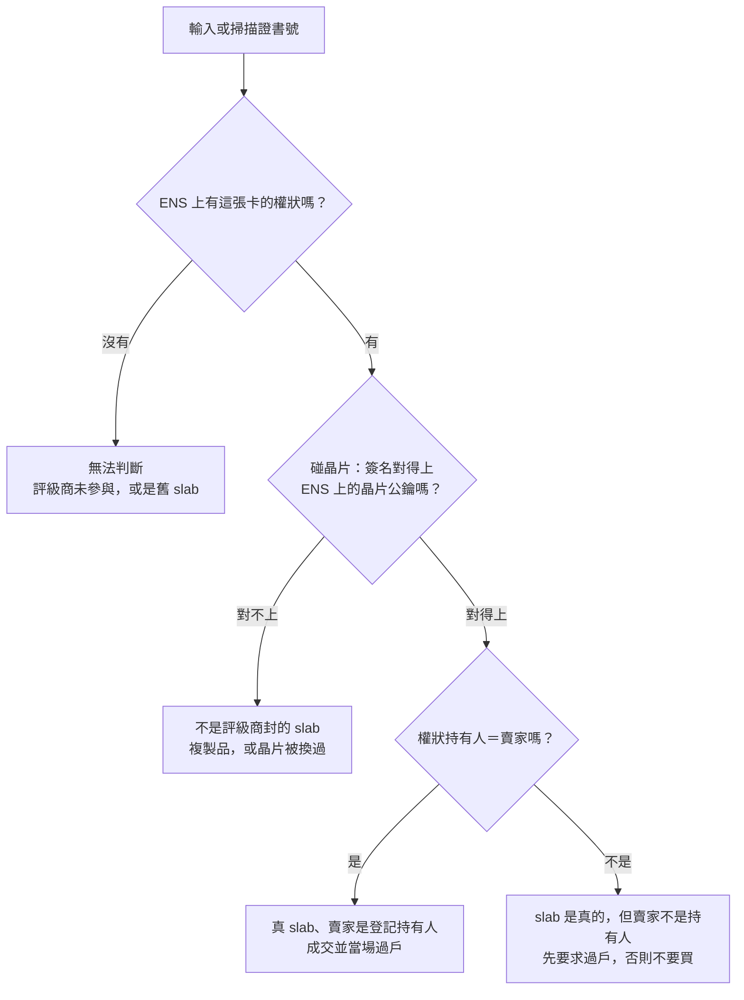
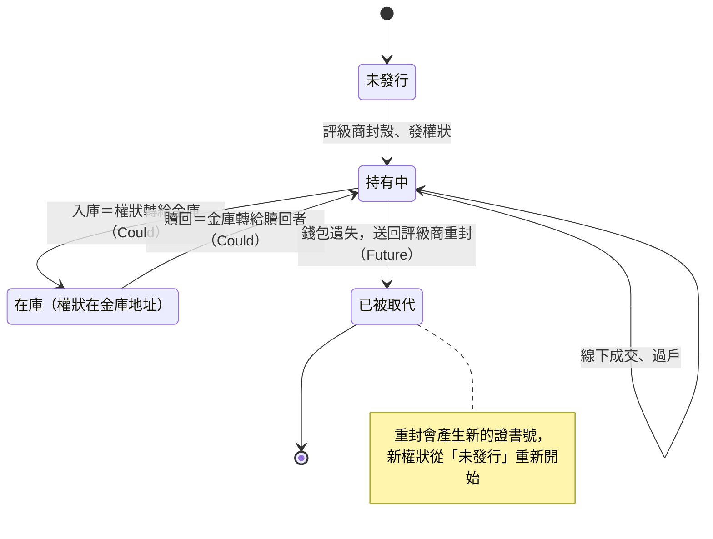

# Nafuda 名札 — 鑑定卡權狀：黑客松計劃 v2

> 2026-09-25（開賽日）。ETHGlobal Tokyo，ENSv2 賽道，單人參賽。**提交截止：2026-09-27（日）09:00 JST。**
> 取代 [card-custody-plan.md](card-custody-plan.md)（v1，以金庫保管為核心）。v1 的研究結論與 ETHGlobal 規則仍然適用，本文件只寫 v2 的內容。
> 合約行為都對照過 `contracts-v2-beta`（= Sepolia Beta 鏈上版本），細節見 [ens-v2.md](ens-v2.md)。專案名 **Nafuda（名札）**，ENS 根名字 `nafuda.eth`（2026-09-25 查過，Sepolia Beta 上還能註冊；H0 註冊前再查一次）。

---

## 0. 相對 v1 改了什麼

| 項目 | v1 | v2 |
|---|---|---|
| 寫入者 | 金庫（保管方） | **評級商**：鑑定封殼時發權狀（demo 用模擬的評級商） |
| 主角 | 跨平台重複入庫 | **線下交易**：買家在收藏展當場驗證 |
| 紀錄內容 | 保管方是誰 | **權狀持有人**（誰）＋**晶片公鑰**（哪一個實體 slab） |
| 名字 | soulbound 的保管名字 | **可轉移的權狀名字**，轉手就是過戶 |
| 涵蓋範圍 | 只有在庫的卡 | 所有由參與的評級商新封的 slab |
| 保管層 | Must | 不需要另外做：**入庫 = 把權狀轉給金庫的地址**（§8） |
| 晶片 | 不做 | **模擬**，介面跟 Arx HaLo 相同，之後可以直接換成真晶片 |

一句話：**「證書號可以抄，晶片抄不了；卡可以偷，權狀偷不走。」**

標語：**Every slab wears its name.**（每張卡，都有自己的名札。）名札的「名」對應 ENS 的 name，「札」是卡片（歌留多的「札」）。

模擬評級商叫 **PSA-Sim**（label `psa-sim`）。免責聲明，README、頁面、影片都要放：「PSA-Sim 是模擬評級商，證書號格式與流程參照 PSA（Professional Sports Authenticator），與 PSA 無任何關係，也未經其授權。」PSA 是依序發號的，demo 用的證書號在 PSA 真的資料庫裡可能對應到別張卡，所以影片裡不要說「去 PSA 查這個號碼」。

---

## 1. 定位

### 1.1 問題

- 偽造者用「同卡同分數」的真證書號印假標籤。PSA 查詢只證明號碼存在，所以複製品查得過。
- PSA 證書號是依序發的，從連號就能找到同款卡從沒公開過的證書號，所以「避開公開過的號碼」防不了。
- 業界已經往晶片走：PCGS（錢幣）從 2020 年起在 slab 裡嵌 NFC 晶片，NFC Authenticators 在 2026 年 5 月推出卡片 slab 的晶片驗證。但它們都是「晶片＋自家資料庫」：每家各管各的，而且不管所有權。

### 1.2 我們做什麼

評級商封殼時，把晶片公鑰和初始持有人寫進一個 ENS 名字（`12345678.psa-sim.nafuda.eth`）。線下交易時，買家驗兩件事：

| 驗證 | 怎麼驗 | 抓到什麼 |
|---|---|---|
| **晶片** | 買家產生一個隨機挑戰 → slab 的晶片簽名 → 用 ENS 上的 `slab.chip` 驗證 | 複製品（晶片私鑰拿不出來，複製不了） |
| **權狀** | ENS 名字解析到的地址（`addr`）＝賣家嗎？ | 偷來的卡、沒有過戶的卡 |

成交時，賣家把權狀名字轉給買家（ERC-1155 `safeTransferFrom`），這張卡的名字從此解析到新的持有人。

### 1.3 驗證結果

| 晶片 | 權狀持有人 | 驗證頁顯示 |
|---|---|---|
| ✓ | ＝賣家 | 這是評級商封的那個 slab，賣家就是登記的持有人 |
| ✓ | ≠賣家 | slab 是真的，但賣家不是登記的持有人：先要求過戶，不過戶就不要買（可能是贓物，或過戶沒做完） |
| ✗ | — | **這不是評級商封的 slab**（複製品，或晶片被換過） |
| 名字不存在 | — | 這個證書號沒有權狀（評級商沒參與，或是舊的 slab），無法判斷 |

### 1.4 為什麼用 ENS（評審會問）

1. **中立、可以跨評級商。** 每家評級商在同一個命名空間下各自擁有一個 registry（`psa-sim.`，將來可以有 `cgc.`、`bgs.`……），不是某一家公司的資料庫。這正是 ENS 評審點名要看的階層 registry。
2. **權狀轉手有 v2 內建的買方保護。** `safeTransferFrom` 會要求 registry 是 emancipated（評級商和營運方都收不回），而且 token 上只有持有人一個 assignee（沒有藏起來的委派者）。這兩個保證本來就是 v2 的設計，我們直接拿來用，不用自己寫。
3. **任何 client 都查得到。** `getEnsAddress("12345678.psa-sim.nafuda.eth")` 回傳的就是目前的持有人，`getEnsText(…, "slab.chip")` 回傳的就是晶片地址。資料由 wildcard resolver 從鏈上狀態即時算出來，不需要我們的 API。

### 1.5 誠實的邊界（pitch 主動講）

- **需要評級商參與**：demo 用模擬的評級商。PSA 為什麼要做？因為複製品傷害的是它的品牌，而且業界已經開始做晶片（§1.1）。但這仍然是 T3 的開放問題。
- **只涵蓋新封的 slab**：現有的上億個 slab 沒有晶片，查起來都是「沒有權狀」。要補上只能重新封殼。
- **晶片是模擬的**：正式版必須由評級商在封殼時把晶片封在**殼裡面**。外貼的晶片可以撕下來貼到假 slab 上。
- **卡和權狀可以分開賣**：賣家可以只賣卡、不過戶。晶片加權狀的組合會把這種情況標成「持有人不符」，但擋不住不查的買家。
- **emancipation 的代價**：評級商凍結不了被偷的權狀；持有人弄丟錢包，權狀也跟著丟。這是「沒有人能收回」這個保證的另一面。弄丟錢包的解法是送回評級商重封，列在 Future work（§8.1），黑客松不做。
- **NFC relay 攻擊**：有人可以把挑戰轉送給遠方的真 slab 來簽。這是 NFC 驗證普遍的限制，要靠距離限制或逾時來降低風險，不在這次的範圍內。
- **隱私**：持有人地址是公開的。高價卡的持有人應該用專用地址。

### 1.6 商業架構圖

#### 圖 A　參與者與價值流

實線是實體、金錢或權利的移動，虛線是查詢與驗證。



#### 誰付出、誰得到

| 角色 | 付出 | 得到 |
|---|---|---|
| 評級商 | 晶片成本、每張權狀一筆發行交易的 gas | 複製品不再侵蝕品牌；「晶片＋權狀」可以做成加值方案（**提案**） |
| 送評人／持有人 | 送評費（加值方案可能更貴） | 可以證明的所有權；轉賣時買家更敢出價 |
| 買家 | 無，查詢免費 | 當場驗證 slab 是不是真的、賣家是不是持有人 |
| 市集、錢包、agent | 讀 ENS 的整合 | 不用跟每家評級商各自串接 API |
| 營運方（我們） | 維運命名空間、鎖定前的治理責任 | **待定**：公共財，或向評級商收費 |

#### 圖 B　一張卡的一生



#### 圖 C　買家在現場的判斷



#### 圖 D　權狀的生命週期（標 Could／Future 的轉換黑客松不做）



---

## 2. 名字樹與角色

```
nafuda.eth                               operator EOA（ETHRegistrar，MockUSDC，註冊 10 年）
└─ nafudaRegistry（UserRegistry，operator）
   └─ psa-sim → psaRegistry（UserRegistry）    resolver = TitleController（wildcard）
       ├─ 12345678    owner = 持有人，roleBitmap = CAN_TRANSFER_ADMIN，expiry = uint64.max，resolver = 0
       └─ 12345679    …
```

- `12345678` 這個 entry 的 resolver 是 0，所以 UR 會回落到 `psa-sim` 的 resolver，也就是 TitleController。沒發過權狀的證書號也一樣回落到它，回應「沒有權狀」。
- **Label 規則**：每家評級商一個 registry，label 就是證書號本身：只能是數字、不能有前導 0、最多 10 位。由合約檢查，否則同一張卡會出現兩個名字。

### 2.1 角色配置（上線後的最終狀態）

| 對象 | 誰持有什麼 | `isEmancipated()` |
|---|---|---|
| psaRegistry root | TitleController：`REGISTRAR`；模擬評級商 EOA：`REGISTRAR_ADMIN`（可以換發行合約）、`SET_PARENT`、`CAN_NAME` | **true** |
| 權狀 token | 持有人：只有 `CAN_TRANSFER_ADMIN` | — |
| nafudaRegistry root、`psa-sim` token、`nafuda.eth` token | 最後鎖定之前是 operator 全權（§4 第 10 步） | 鎖定前 false |

**持有人不能拿 `SET_RESOLVER`**，否則他可以把 resolver 換成自己的，偽造晶片地址。權狀的 resolver 永遠是 0，而 psaRegistry root 上沒有人持有 `SET_RESOLVER`（emancipated），所以誰都改不了。

**營運方的權力**（demo 要誠實列出來）：在最後鎖定之前，營運方可以替換整個 `psa-sim` 子樹：它持有 nafudaRegistry 的 root 權限、`psa-sim` token 的 `SET_SUBREGISTRY` / `SET_RESOLVER`、`nafuda.eth` 的 `SET_SUBREGISTRY`。鎖定之後就不能了。評級商可以換一個新的發行合約，但只能對還沒發過權狀的證書號發行，已經發出去的權狀不會被覆蓋（registry 會 revert `LabelAlreadyRegistered`）。等 Future work 的重封救回做了之後，評級商會多一個「把證書號標成已被取代」的權力（§8.1）。

---

## 3. 合約：`TitleController`

一支合約兼兩個角色：psaRegistry 的發行者（registrar），以及 `psa-sim.nafuda.eth` 的 wildcard resolver。不可升級，晶片地址寫入後就不能改。這是 v1 `CustodyController` 的同一個模式。

### 3.1 狀態

```solidity
IPermissionedRegistry immutable REGISTRY;   // psaRegistry
address immutable GRADER;                   // 模擬評級商 EOA
struct Slab { address chip; uint64 issuedAt; string card; string grade; }
mapping(uint256 labelId => Slab) slabs;
```

### 3.2 函式

| 函式 | 誰 | 行為 |
|---|---|---|
| `issue(cert, holder, chip, card, grade)` | `GRADER` | 檢查 label 規則、`chip != 0`、還沒發過 → `REGISTRY.register(cert, holder, 0, 0, CAN_TRANSFER_ADMIN, type(uint64).max)` → 寫入 `slabs` → emit `TitleIssued` |
| `resolve(name, data)` | 任何人（view） | 取出第一個 label。`addr(60)` / `addr(bytes32)` → `REGISTRY.getOwner(id)`，也就是持有人。text：`title.status`（`ISSUED` / `NONE`）、`slab.chip`（hex 地址）、`card`、`grade`、`issued_at`。其他 key 回空字串 |
| `supportsInterface` | — | `IExtendedResolver` + ERC-165（非 leaf 的 resolver 必須支援） |
| `verifyChip(cert, message, sig) view` | 任何人（Should） | 用 `ecrecover` 還原 EIP-191 簽名者，比對 `slabs[id].chip`。讓其他合約（例如託管交易）也能在鏈上驗晶片 |

轉手不經過 controller，就是一般的 ERC-1155 `safeTransferFrom`。這是刻意的：任何錢包、ENS App（如果它支援的話，見 §9）都能做過戶。

### 3.3 晶片挑戰格式

```
ENS-SLAB|<grader>|<cert>|<nonce 32 bytes hex>|<unix 秒>
```

- 用 EIP-191 `personal_sign` 簽名，因為 HaLo 原生支援 EIP-191。
- nonce 由買家的頁面產生，時間超過 60 秒就不接受。

**原則：晶片簽名只能當「證明」，不能當「授權」。** 任何合約都不可以因為收到一個晶片簽名，就移動權狀或改變狀態。晶片會替任何碰它的人簽任何訊息，而我們的設計本來就鼓勵賣家讓買家碰 slab。如果晶片簽名可以授權操作，任何短暫經手的人都能把權狀轉走。

### 3.4 Foundry 測試（Gate A 要全部通過）

1. `issue` 之後：owner 是持有人、status 是 ISSUED，持有人的角色**只有** `CAN_TRANSFER_ADMIN`
2. 同一個證書號發第二次 → revert；非評級商呼叫 → revert
3. label 規則：前導 0、非數字、超過 10 位 → revert
4. 設定完成後 `psaRegistry.isEmancipated() == true`；持有人 `safeTransferFrom` 給買家成功，買家可以再轉賣
5. 持有人呼叫 `setResolver` / `setSubregistry` → `EACUnauthorizedAccountRoles`
6. `resolve()`：`addr` 是持有人，轉手後變成新持有人；`slab.chip`、`card`、`grade` 正確；沒發過的證書號回 `NONE`
7. 晶片：用晶片私鑰簽的 → 通過；用其他私鑰簽的 → 不通過（前端的驗證邏輯和 `verifyChip` 用同一組測試向量）
8. （Should）用 Beta fixture 的 UniversalResolverV2 走一次完整解析

---

## 4. 部署（Sepolia Beta）

所有地址集中在 `addresses.ts`，腳本要能一鍵重跑。先在 anvil fork 上完整彩排一次。需要準備的 EOA 都要是新的：operator、grader、alice（第一任持有人）、bob（買家）、mallory（拿著複製品的人）。

1. 選名字，用 `ETHRegistrar.isAvailable` 查（另外準備 3 個備選）
2. `MockUSDC.mint` → `commit` → 等 60 秒 → `register`（10 年）
3. 部署 nafudaRegistry（operator 持有 `ALL_ROLES`）→ `ETHRegistry.setSubregistry` → `setParent`
4. 部署 psaRegistry（先給 grader `ALL_ROLES`）
5. 部署 `TitleController(psaRegistry, grader)`
6. `nafudaRegistry.register("psa-sim", grader, psaRegistry, controller, …)` → `psaRegistry.setParent`
7. grader：`psaRegistry.grantRootRoles(REGISTRAR, controller)`
8. grader：把自己在 root 上 `UNEMANCIPATED_ROLE_BITMAP` 裡的角色（`SET_SUBREGISTRY` / `SET_RESOLVER` / `UNREGISTER` / `UPGRADE`，連同 admin）全部撤掉 → 確認 `isEmancipated() == true`
9. grader：`issue` 兩張 demo 權狀（alice 持有），每張 slab 各一把模擬晶片私鑰，存在 `demo/slabs/*.json`
10. **最後鎖定（不可逆，Gate C 之後、錄影之前做）**：撤掉 `psa-sim` token 的 `SET_SUBREGISTRY` / `SET_RESOLVER`、nafudaRegistry root 的危險角色、`nafuda.eth` token 的 `SET_SUBREGISTRY`（全部連同 admin）

**Gate B**：`getEnsAddress("12345678.psa-sim.nafuda.eth") == alice`；`getEnsText(…, "slab.chip")` 等於晶片地址；沒發過的證書號回 `NONE`。

---

## 5. 前端

Vite + TypeScript + viem 2.56.8，不用框架。要顯式傳 `universalResolverAddress: 0xeEeE…EeEe`。部署成公開網址（ENS 獎的必要條件：live link）。

- **買家頁**：輸入證書號 → 顯示卡名、分數、持有人、晶片地址 → 按「碰一下 slab」→ 產生挑戰 → 收到簽名 → 驗證 → 依 §1.3 的表格顯示結果。「賣家是誰」用賣家錢包對同一個挑戰簽名來證明（Should），或者直接在現場過戶。
- **模擬 slab**：一個獨立的面板，載入 `demo/slabs/<cert>.json` 裡的私鑰，介面是 `sign(message) → signature`，跟 libhalo 的 `execHaloCmdWeb({ name: 'sign', message })` 相同，之後換成真的 HaLo 只要改這一個函式。複製品 slab 是另一把私鑰。畫面上要清楚標示「模擬晶片」。
- **過戶**：賣家頁用注入的錢包呼叫 `safeTransferFrom`（Should：也做成 script 當備案）。
- 頁面附一段 viem 程式碼，示範任何 ENS client 都查得到。

---

## 6. Demo 劇本（2–4 分鐘，自己配音）

1. **問題**（20 秒）：複製品用真的證書號，PSA 查得過；業界開始做晶片，但每家各自一個資料庫
2. 模擬評級商封殼 → `issue` → `12345678.psa-sim.nafuda.eth` 解析到 alice
3. **收藏展**：bob 想買 alice 的卡 → 碰一下 → 晶片 ✓、持有人是 alice ✓ → 成交，alice 當場 `safeTransferFrom` → 名字改為解析到 bob
4. **複製品**：mallory 拿著同證書號的 slab → 碰一下 → ✗「這不是評級商封的 slab」
5. **偷來的真卡**：mallory 拿著 bob 的真卡（沒有權狀）→ 晶片 ✓、持有人 ≠ mallory → 「先要求過戶」
6. **v2 的保證**：`isEmancipated() == true` → 評級商和營運方都收不回權狀；持有人 `setResolver` → revert → 晶片地址改不了
7. 終端機用純 viem 的 `getEnsAddress` / `getEnsText` 查同一個名字

---

## 7. 36 小時時程（單人）

H0 = hacking 開始，開賽後才建新 repo。H36 不能晚於 9/27 09:00 JST。

| 時段 | 工作 | 關卡 |
|---|---|---|
| H0–H1 | 新 repo：Foundry，`contracts-v2` 用 submodule 釘在 `71a3b733`；viem 腳本骨架；決定名字 | |
| H1–H5 | `TitleController` 的 `issue` 和 registry 設定，測試 1–5 | |
| H5–H7 | `resolve()`、晶片驗證，測試 6–7 | **Gate A（H7）**：測試全過。H9 還沒過 → 先砍 `verifyChip`、`issued_at` 這些細節，**resolver 不能砍** |
| H7–H10 | 部署腳本（第 1–9 步），在 anvil fork 上彩排 | |
| H10–H12 | 部署到 Sepolia、發 demo 權狀 | **Gate B（H12）** |
| H12–H18 | 睡覺 | |
| H18–H23 | 買家頁、模擬 slab、過戶 | |
| H23–H25 | 在 Sepolia 上跑一遍劇本 1–7 | **Gate C（H25）** |
| H25–H28 | Should：賣家簽名證明、`verifyChip`、UR 端到端測試、第 10 步鎖定 | |
| H28–H31 | README（含 AI 使用揭露、Curvegrid 要求的內容）、簡報、錄影 | |
| H31–H36 | 提交、緩衝、準備評審問答 | |

---

## 8. Could

- **入庫 = 權狀轉給金庫**：金庫的地址用 primary name（`vault-a.nafuda.eth`）來識別。驗證頁顯示「持有人是 vault-a」，就等於 v1 的 VAULTED，不用另外做保管 registry
- **原子交換託管**：`TitleEscrow` 在一筆交易裡同時完成 MockUSDC 付款和權狀過戶，買賣雙方都不用信任對方
- **第二家評級商**（`cgc.`），展示「跨評級商」
- **真的 HaLo 晶片**：現場有人帶的話就借來換上

### 8.1 Future work（黑客松不做，評審問到再講）

**弄丟錢包：送回評級商重封。** 整個系統的信任本來就建立在評級商身上，所以救回也交給評級商。

1. 持有人把 slab 送回評級商，評級商實際檢驗卡片、晶片和持有人身分。
2. 評級商拆殼重封：新的證書號、新的晶片、新的權狀，發給持有人的新地址。
3. 舊證書號在 `TitleController` 裡標成 `SUPERSEDED`，並指向新的證書號；新證書號記錄 `supersedes`。舊權狀即使還留在弄丟的錢包裡，驗證頁也會顯示「已被 N 取代」，實際上已經作廢。

為什麼這樣做：
- 不用把舊名字從原持有人那裡拿回來，所以不違反 emancipation，safe transfer 對買方的保護也維持不變。
- 舊晶片隨著舊殼一起銷毀，不會有兩個有效的晶片。
- 不讓晶片簽名授權任何操作（§3.3 的原則）。

代價：評級商多一個權力，可以把任何證書號標成已被取代，也就是可以讓一張權狀失效。所以濫用的風險，跟「評級商能對沒發過的證書號發權狀」一樣，都屬於「信任評級商」的範圍，要寫進權力表。

不採用的做法：讓持有人用實體晶片自己救回權狀。這會讓權狀變成「誰拿著卡誰就是主人」，偷卡的人就能救回權狀；也會開一個「碰一下 slab 權狀就被轉走」的攻擊面；而且跟 emancipation 衝突。

---

## 9. 風險

| 風險 | 對策 |
|---|---|
| Beta 在活動期間重新部署 | 腳本一鍵重跑；workshop 問清楚 |
| 名字已被註冊 | 備選 3 個，H0 就查 |
| 評審嫌晶片是模擬的 | 介面跟 HaLo 相同、PCGS 已經在做；現場借得到 HaLo 就換真的 |
| ENS App / Explorer 不顯示自建 registry 的名字或不能過戶 | 過戶用自己的頁面加腳本；demo 主畫面用自己的頁面加終端機 |
| 第 10 步鎖定之後才發現錯誤 | 鎖定是最後一步，錄影前才做；在那之前的 demo 要誠實說「營運方目前還能替換整棵樹」 |
| viem 與 UR 版本不合 | 固定 2.56.8，顯式傳 UR 地址 |
| ETHGlobal 規則：開賽後才建 repo、要有連續的 commit、揭露 AI 使用、影片 2–4 分鐘自己配音 | 照 v1 §9 和 §11 的規定做；本計劃要放進提交的 repo |
| 單人體力 | 照關卡砍功能；H12–H18 一定要睡 |

---

## 10. 15:00 ENS workshop

1. **活動期間 Sepolia Beta 會不會重新部署？**
2. **ENS App Beta / Explorer 會不會顯示自建 UserRegistry 底下的名字？能不能對它們做 transfer？會不會呼叫 wildcard ExtendedResolver？** 能做 transfer 的話，過戶就可以直接用 ENS App
3. 評審會特別看哪些 v2 功能（emancipation、safe transfer、階層 registry）？非 agent 的用例會不會被打折？

16:00 Curvegrid：README 的必要內容；同一個專案能不能角逐兩個 Curvegrid 獎。提交前確認每個專案能勾幾個 partner prize。

---

## 11. 投哪些獎

| 獎 | 判斷 |
|---|---|
| **ENS：Best Use of ENSv2**（$6,000） | 主獎。點名的 wildcard resolution、Enhanced Access Control（emancipation、safe transfer）、階層 registry 都是核心 |
| **Curvegrid：Best RWA Tokenization**（$1,000） | 對得上，而且比 v1 更貼合：權狀就是實體資產所有權的鏈上表示，搭配可程式化的轉移規則 |
| World、Uniswap、1inch、Sui、Intercepta | 不做（理由見 v1 §13） |

## 12. 還沒決定的

- ~~名字~~：已定案，Nafuda / `nafuda.eth`；模擬評級商是 PSA-Sim（`psa-sim`）
- GitHub repo 要不要一開始就 public
- 前端放在哪裡（H18 再決定）
